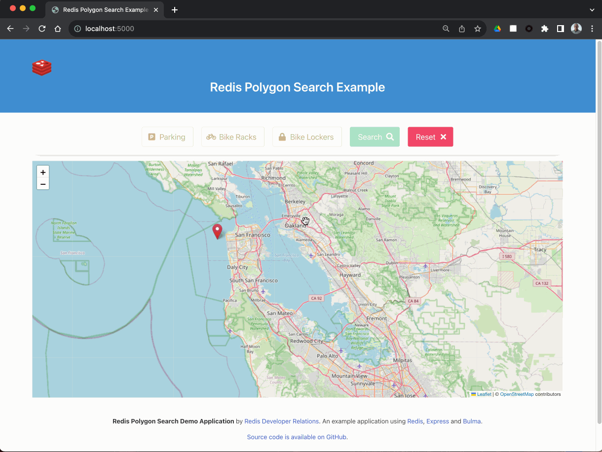

# Redis Stack Polygon Search Trains Demo



## Introduction

This repository is a small self-contained demonstration of the Polygon Search functionality that was added in the 7.2 release of Redis Stack.

For information about this release and the other new features in it, check out the [blog post](https://redis.com/blog/introducing-redis-7-2/).

Using data from the Bay Area Rapid Transit ([BART](https://www.bart.gov/system-map)) system, we'll look at how to use the Search capability of Redis Stack to find stations that fall within an area described by a polygon, and which optionally have certain attributes.

## Prerequisites

You'll need to have the following installed:

* [Node.js](https://nodejs.org/) - version 18 or higher.  We've tested this with Node.js v18.14.2.
* [Docker Desktop](https://www.docker.com/products/docker-desktop/).
* [Git command line tools](https://git-scm.com/downloads) to clone the repository (or if you don't have these, you can get a .zip file from GitHub instead).
* A browser (we've tested this with [Google Chrome](https://www.google.com/chrome/)).
* Optional but recommended: [RedisInsight](https://redis.io/docs/ui/insight/) - a graphical tool for viewing and managing data in Redis.

## Running the Demo

To run the demo, you'll need to clone the repository from GitHub, install the dependencies and start a Redis Stack instance.  We've provided a Docker Compose file for this.  Enter the following commands:

```
git clone https://github.com/redis-developer/redis-polygon-search-trains-demo.git
cd redis-polygon-search-trains-demo
npm install
docker-compose up -d
```

Now load the data:

```
npm run load data/stations.json
```

You should see output similar to this:

```
Stored 12th St. Oakland City Center as station:12th
Stored 16th St. Mission as station:16th
...
Stored West Oakland as station:woak
Checking for previous index and dropping if found.
Dropped old search index.
Creating index.
Done!
```

Finally, start the [Express](https://expressjs.com/) server.  This uses [nodemon](https://www.npmjs.com/package/nodemon), so any changes you make to the source code will cause the server to automatically restart for you.

```
npm run dev 
```

Point your browser at `http://localhost:5000` and start clicking and dragging markers to create a polygon.  

Hit the "Search" button to search for matching stations, use the toggle buttons to specify whether your results must have, for example, parking.

Use the "Reset" button to clear your polygon and any matching search results.

Click on a blue search result marker to see more information about that station in a pop up dialog.

When you're finished using the demo, stop the Express server using `Ctrl-C`, then turn off the Docker container like so:

```
docker-compose down
```

## Redis Data Model

Each station's data is stored as a JSON document using Redis Stack's JSON data type.

Each station has a unique four character ID that BART uses.  We use these as part of the Redis keys, so the JSON document for "Colma" (ID `COLM`) is:

```
station:colm
```

Using a common prefix `station:` allows us to identify what sort of data might be stored at the key more easily, and also allows us to configure the search capability of Redis Stack to only index that part of the keyspace.

Take a look at one of the keys using either RedisInsight or the Redis CLI.

Start the Redis CLI which will automatically connect to Redis at `localhost:6379` (our Docker container):

```
docker exec -it redis-polygon-search-demo r
edis-cli
```

Now use the [`JSON.GET`](https://redis.io/commands/json.get/) command to retrieve a station's document:

```
127.0.0.1:6379> json.get station:colm
"{\"abbr\":\"COLM\",\"name\":\"Colma\",\"description\":\"The Town of Colma is a diverse community on the San Francisco peninsula that maintains that \\\"small town\\\" feel despite being so close to major cities. The Colma BART Station is close to residential neighborhoods and shopping areas. Colma is perhaps best known for its 17 cemeteries, which comprise approximately 73% of the town's land area. The town incorporated in 1924 primarily to protect this land use. Colma's cemeteries represent numerous religious beliefs and nationalities, and include structures and districts which are historically significant on local, state and national levels.\",\"position\":\"POINT(-122.466233 37.684638)\",\"latitude\":37.684638,\"longitude\":-122.466233,\"lockers\":\"true\",\"parking\":\"true\",\"bikeRacks\":\"true\",\"city\":\"Colma\",\"county\":\"sanmateo\"}"
```

If you're using RedisInsight, start it up and add a new connection to Redis at `localhost` port `6379` with no user or password specified.  You can then browse the key space and see the data contained in each key.

You'll see that each station contains a JSON document with the following data items in it:

* `abbr`: The four character unique ID for this station.
* `name`: The name of the station.
* `description`: Text describing the station and local area.
* `position`: A [Well-known Text](https://en.wikipedia.org/wiki/Well-known_text_representation_of_geometry) Point representation of the station's lat/long location.  Example: `POINT(-122.414123 37.779732)` where `37.779732` is the latitude and `-122.414123` is the longitude.  This is required as searching by polygons uses the Well-known Text geometry format.
* `longitude`: The longitude of the station.
* `latitude`: The latitude of the station.
* `lockers`: A true/false text flag indicating whether the station has bike lockers.
* `parking`: A true/false text flag indicating whether the station has a parking lot.
* `bikeRacks`: A true/false text flag indicating whether the station has bike racks.
* `city`: The name of the city that the station is located in.
* `county`: The name of the county that the station is located in.

If you'd like to see the raw data for all 50 stations, take a look in the [`data/stations.json`](data/stations.json) file.

## How does the Demo Work?

### Loading the Data and Creating an Index

TODO

### Serving a Map and Defining the Polygon

TODO

### Searcing for Stations that meet the Criteria

TODO

### Displaying Search Results on the Map

TODO

## Questions / Ideas / Feedback?

If you have any questions about this, or fun ideas for how to use polygon search in your application we'd love to hear from you.  Find the Redis Developer Relations team and thousands of other Redis developers like you on the [official Redis Discord](https://discord.gg/redis).

If you find a bug please [raise an issue on GitHub](https://github.com/redis-developer/redis-polygon-search-trains-demo/issues) and we'll work to fix it.

## Additional Resources

If you'd like to learn more about the technologies and approaches used here, check out these links...

* [RU204 Storing, Querying, and Indexing JSON at Speed](https://university.redis.com/courses/ru204/): a free online course at Redis University.
* The [Node-Redis client](https://github.com/redis/node-redis).
* [Search and Query in Redis Stack](https://redis.io/docs/interact/search-and-query/) (redis.io).
* The [`FT.CREATE`](https://redis.io/commands/ft.create/) command (redis.io).
* The [`FT.SEARCH`](https://redis.io/commands/ft.search/) command (redis.io).
* [ExpressJS](https://expressjs.com/): A web application framework for Node.js.
* The [Bulma CSS Framework](https://bulma.io/).
* [Leaflet](https://leafletjs.com/): A JavaScript library for interactive maps.