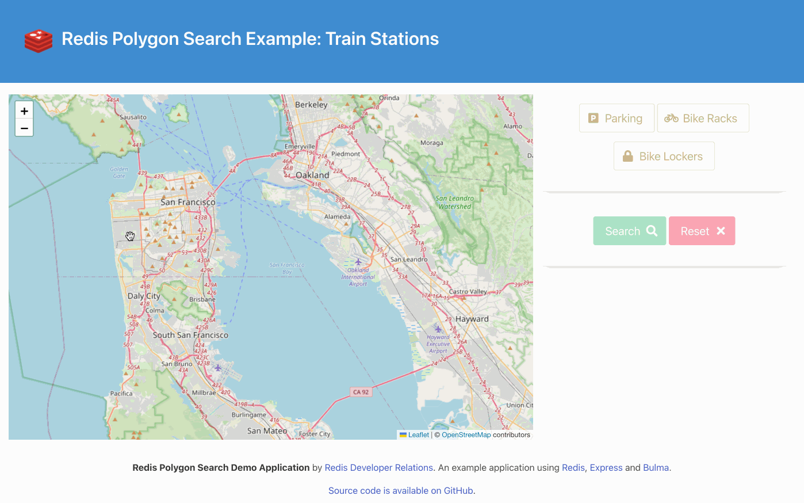

# Redis Stack Polygon Search Trains Demo



## Introduction

TODO

## Prerequisites

You'll need to have the following installed:

* [Node.js](https://nodejs.org/) - version 18 or higher.  We've tested this with Node.js v18.14.2.
* [Docker Desktop](https://www.docker.com/products/docker-desktop/).
* [Git command line tools](https://git-scm.com/downloads) to clone the repository (or if you don't have these, you can get a .zip file from GitHub instead).
* A browser (we've tested this with [Google Chrome](https://www.google.com/chrome/)).
* Optional but recommended: [RedisInsight](https://redis.io/docs/ui/insight/) - a graphical tool for viewing and managing data in Redis.

## Running the Demo

To run the demo, you'll need to clone the repository from GitHub, install the dependencies and start a Redis Stack instance.  We've provided a Docker Compose file for this.  Enter the following commands:

```
git clone https://github.com/redis-developer/redis-polygon-search-trains-demo.git
cd redis-polygon-search-trains-demo
npm install
docker-compose up -d
```

Now load the data:

```
npm run load data/stations.json
```

You should see output similar to this:

```
Stored 12th St. Oakland City Center as station:12th
Stored 16th St. Mission as station:16th
...
Stored West Oakland as station:woak
Checking for previous index and dropping if found.
Dropped old search index.
Creating index.
Done!
```

Finally, start the [Express](https://expressjs.com/) server.  This uses [nodemon](https://www.npmjs.com/package/nodemon), so any changes you make to the source code will cause the server to automatically restart for you.

```
npm run dev 
```

Point your browser at `http://localhost:5000` and start clicking and dragging markers to create a polygon.  

Hit the "Search" button to search for matching stations, use the toggle buttons to specify whether your results must have, for example, parking.

Use the "Reset" button to clear your polygon and any matching search results.

Click on a blue search result marker to see more information about that station in a pop up dialog.

When you're finished using the demo, stop the Express server using `Ctrl-C`, then turn off the Docker container like so:

```
docker-compose down
```

## Redis Data Model

TODO

## How Does it Work?

TODO

## Questions / Ideas?

If you have any questions about this, or fun ideas for how to use polygon search in your application we'd love to hear from you.  Find the Redis Developer Relations team and thousands of other Redis developers like you on the official Redis Discord.